# Smart Light 

`Smart Light` 使用 `ESP32、ESP32S2` 配合 `腾讯连连小程序` 演示了一个智能灯控制方案。

功能：
- 通过腾讯连连小程序配网、控制
- 支持 `OTA` 升级功能、版本回滚

# 详细说明

## 0. 一些准备工作

- 拥有搭载 `ESP32、ESP32S2` 芯片的硬件平台
- 拥有 `ESP-IDF release/v4.2` 的环境，你可参考该 [文档](../../README.md) 完成搭建
- 正常使用的微信号

## 1. 云平台设置

1. **新建产品**

    你需要在 [腾讯物联网开发平台 (IoT Explorer)](https://console.cloud.tencent.com/iotexplorer) 新建项目，随后即可新建产品。

<div align="center">  
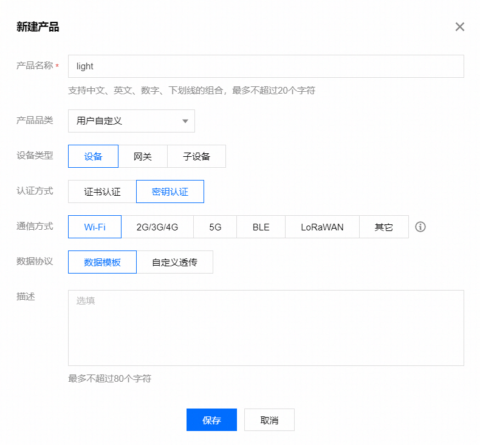
</div>

2. **数据模板**

    通过 `标准功能-导入 JSON ` 添加标准属性，[点击查看 light 的 json 文件](./data_template_light.json) 。

<div align="center">  
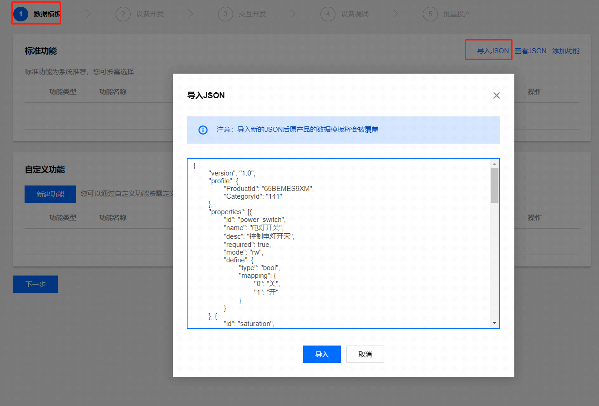
</div>

3. **设备开发**

    此处可不进行选择。

4. **交互开发**

    此处可配置设备的首选、次选配网方案。当前例程支持乐鑫方案下的 `Soft Ap`、 `Smart Config`、 `AirKiss`。

<div align="center">  
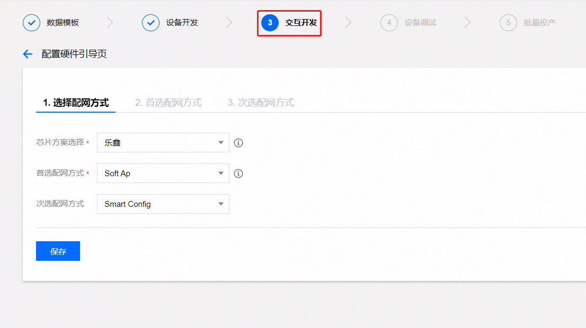
</div>

5. **设备调试**

    此处新建一个设备，随后可点击该设备查看 `产品 ID (PRODUCT_ID)`、`设备名称 (DEVICE_NAME)`、 `设备密钥 (DEVICE_SECRET)`。

<div align="center">  

</div>

6. **批量生产**

    此处可以查看 `配网二维码`。

<div align="center">  
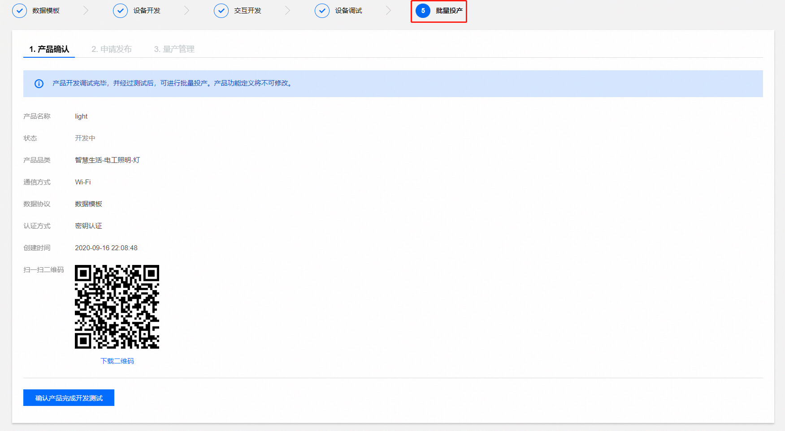
</div>

>该二维码与随后设备端生成的二维码功能相同。

## 2. 设备设置

1. **设置 `light` 接口**

    1. **进入 `menuconfig` 配置界面**

        ```shell
        idf.py menuconfig
        ```

    2. **在 `ESP QCloud Example Configuration -> Light development board selection -> light hardware type` 中选择 `Custom`**

        ```shell
        ( ) ESP32 moonlight
        ( ) ESP32-MeshKit Light
        (X) Custom
        ```

    3. **根据 `light` 种类填写对应 `GPIO` 号**

        若是 `单色 LED`，可随意接入任意 `RGB` 脚，`单色 LED` 只能完成开关功能，无法调色。若是 `RGB`、`RGB + 色温色调`，请按实际 `GPIO` 接入。

        ```shell
        (25) Light red pin GPIO number
        (26) Light green pin GPIO number
        (27) Light blue pin GPIO number
        (4) Light cold color pin GPIO number
        (16) Light warm color pin GPIO number
        (500) The time from the current color to the next color
        (3000) Period of blinking lights
        ```
        
        在配网时，`light` 会进入呼吸灯模式，用以提示状态。
        - `The time from the current color to the next color`，可配置颜色切换的时间。
        - `Period of blinking lights`，可配置呼吸灯循环的周期。

2. **烧录认证信息**
    
    认证信息通常为 `PRODUCT_ID`、 `DEVICE_NAME`、 `DEVICE_SECRET`，当成功获取到认证信息时，可以选择下述任意一种方式完成信息烧录。
    - **通过 `menuconfig` 配置界面**
        1. **进入 `menuconfig` 配置界面**

            ```shell
            idf.py menuconfig
            ```

        2. **选择 `ESP QCloud Config` 选项**

            ```shell
            [ ] ESP Qcloud Mass Manufacture
            (PRODUCT_ID) Product ID
            (DEVICE_NAME) Device Name
            (DEVICE_SECRET) Device Secret
            ESP QCloud OTA Config  --->
            Qcloud utils  --->
            ESP QCloud Log Config  --->
            UART for console input (UART0)  --->
            ```

            - **不**开启 `ESP Qcloud Mass Manufacture` 选项。

        3. **填入你的信息**

            填写你的 `产品 ID (PRODUCT_ID)`、 `设备名称 (DEVICE_NAME)`、 `设备密钥 (DEVICE_SECRET)`。
        
    - **通过量产工具配置**
    
        请参考量产工具目录下的 [文档](./../../config/mass_mfg/README.md)，另外需要 <b>开启</b> `ESP Qcloud Mass Manufacture` 选项。

3. **构建&运行工程**

    通过下述命令，可快速构建、下载工程并打开监视器。

    ```shell
    idf.py flash monitor
    ```

4. **设备配网**

    如果一切顺利，`shell` 窗口将打印一个二维码，并打印热点配网使用的 `SSID`，使用 `微信` 扫码，按提示完成后续操作，设备默认启动 `Soft Ap` 配网。

    >该二维码与云端生成的二维码功能相同。

    <div align="center">  
    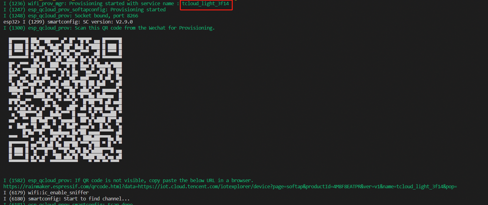
    </div>

    1. **立即绑定**

        如果一切正常，扫描二维码后将看到下述界面。

    <div align="center">  
    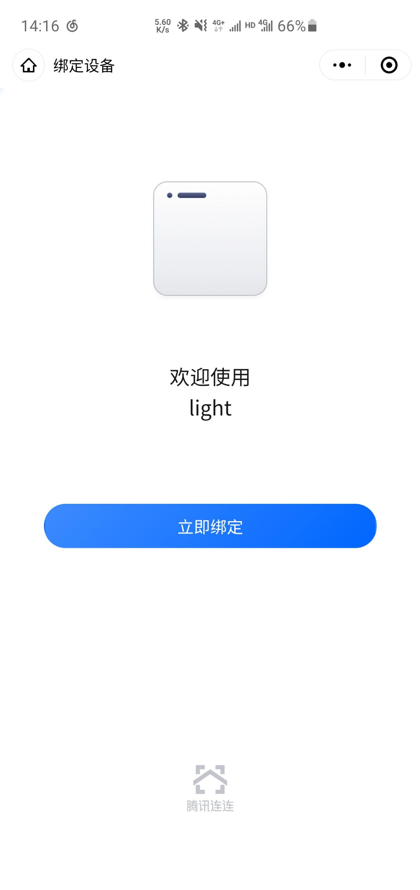
    </div>

    2. **开始配网**

        - **一键配网**

            一键配网使用的是乐鑫 `esp-touch v1` 协议。

        <div align="center">  
        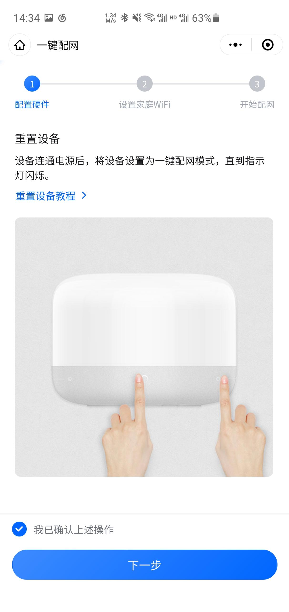
        </div>

        - **微信配网**

            微信一键配网使用的是腾讯 `AirKiss` 协议。

        <div align="center">  
        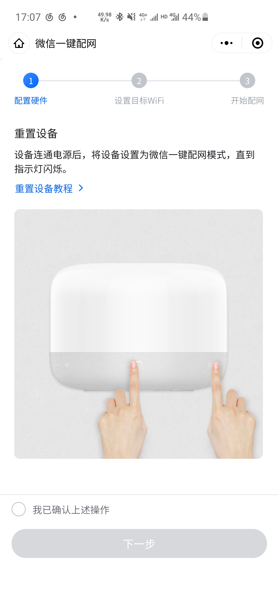
        </div>

        - **热点配网( SoftAp 配网)**

            热点配网需要填入设备的 `SSID` 信息，可从监视器中查看。

        <div align="center">  
        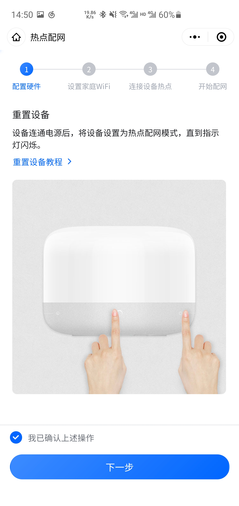
        </div>
        
        <div align="center">  
        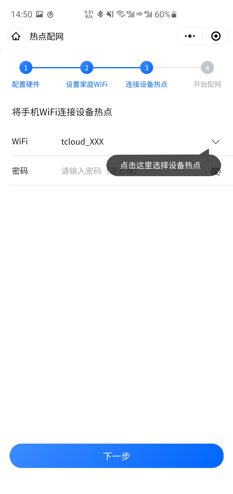
        </div>

        - **蓝牙辅助配网( BLE 配网)**

            蓝牙辅助配网的 `local name` 默认为 `QCloud`。

        <div align="center">  
        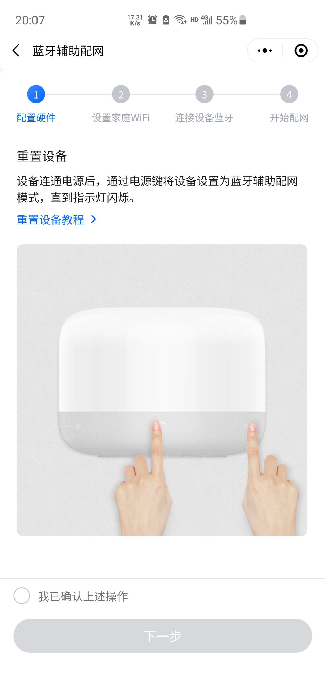
        </div>
        
        <div align="center">  
        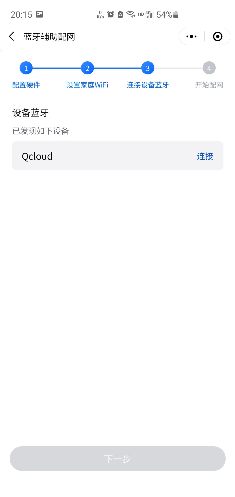
        </div>

    3. **等待配网结果**

        成功后可在主页查看设备信息。

        <div align="center">  
        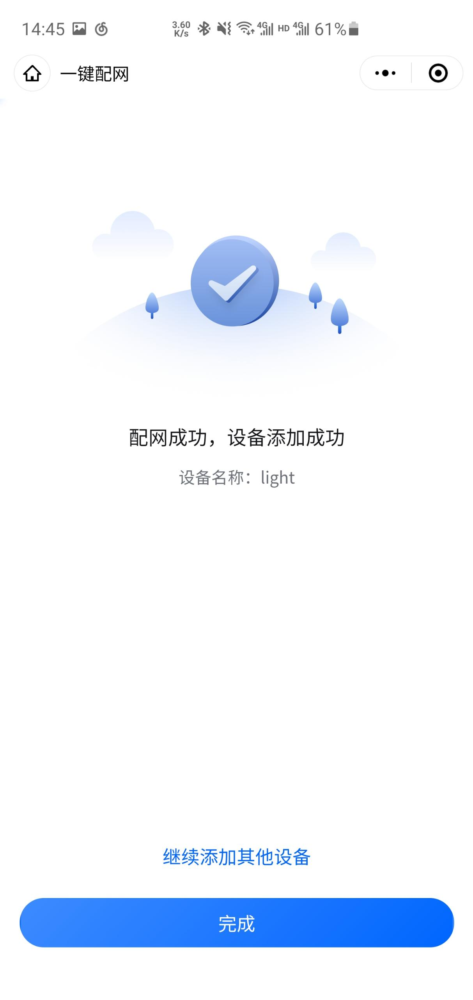
        </div>

    配网成功后，小程序与你的设备将形成绑定关系，同时会记录 `Wi-Fi` 的相关信息。如果想清除配网信息，可使用下述两种方法。

     - **使用 `esptools` 工具擦除**

        若通过量产工具烧录认证信息，执行此命令后，需要再次完成烧录认证信息。

        ```shell
        idf.py erase_flash
        ```

    - **使用快速复位按键**

        在乐鑫提供的开发板中，可快速重复按下 `RST` 按键 5 次。若使用芯片，快速上电、掉电 5 次也可完成此操作。当前例程可修改复位次数及时间，方法如下：

        1. **进入 `menuconfig` 配置界面**

            ```shell
            idf.py menuconfig
            ```
        
        2. **选择 `ESP QCloud Example Configuration`**

            ```shell
            Light development board selection   --->
            (5) More than this number of continuous uninterrupted restarts triggers a reset of the device
            [ ] The device will be in debug mode
            ```

            - `More than this number of continuous uninterrupted restarts triggers a reset of the device`，该选项可配置复位所需的次数。

        3. **选择 `ESP QCloud Config -> QCloud utils`**
            
            ```shell
            The memory location allocated by QCLOUD_MALLOC QCLOUD_CALLOC and QCLOUD_REALLOC (default allocation strategy)  --->
            [*] Memory debug
            (128) QCLOUD Memory debug record max.
            (qcloud_app) Namespace where data is stored in NVS
            (3000) Continuous reboot interval(ms)
            (30) Continuous restart triggers version rollback
            ```    

            - `Continuous reboot interval`，该选项可配置重启间隔时间。

    当前例程可通过下述方法修改配网方式，同时此处也能修改`Soft Ap 配网` 使用的 `SSID` 与 `PSW`。

    - **修改配网方式**

        1. **进入 `menuconfig` 配置界面**

            ```shell
            idf.py menuconfig
            ```

        2. **选择 `ESP QCloud Example Configuration -> Light provisioning network selection`**

            ```shell
            [*] Enable SmartConfig's smart network configuration method
            [*] Enable SoftAP's network configuration method
            [*] Enable BLE's network configuration method
            (tcloud_XXX) SoftAP ssid
            ()      SoftAP password
            ()  SoftAP password
            (Qcloud) BLE name
            ```  

            - 当开启 `Enable SoftAP's network configuration method`，将能看到配置 `SSID`与 `PSW` 的选项。
            - 当开启 `Enable SmartConfig's smart network configuration method`，将默认同时启动 `esp-touch v1` 与 `AirKiss` 协议。
            - 当开启 `Enable BLE's network configuration method`，将能看到配置 `BLE name`。
            >为了能够正常配网，至少需要保证一项的开启，当前支持三种配网同时开启。当同时开启，配网速度将受到一定的影响。

5. **控制**

    - **查看设备**

        该页面可查看所有设备信息，当设备不在线时图标为灰色。

    <div align="center">  
    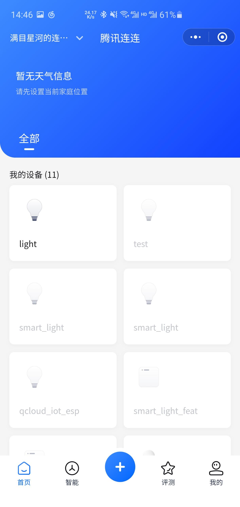
    </div>

    - **控制**

        点击在线设备，可以实现亮度、颜色、状态的控制。

    <div align="center">  
    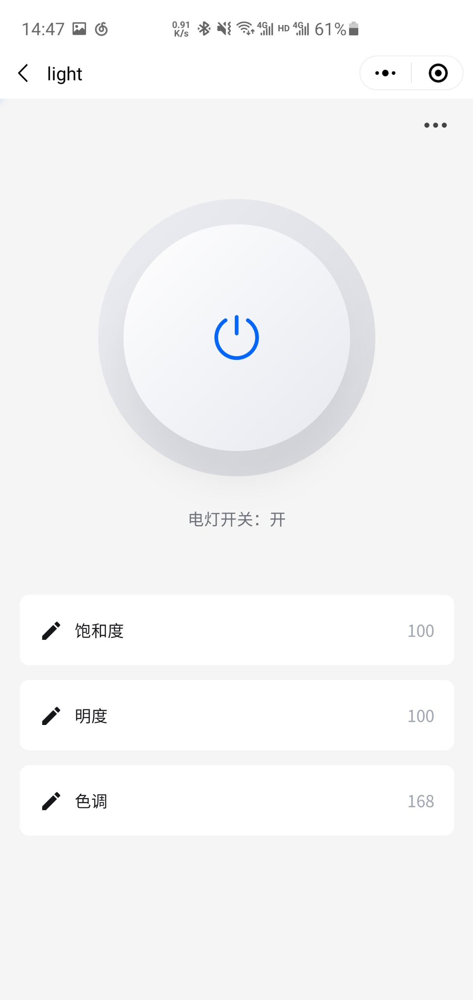
    </div>

6. **OTA 升级**

    1. **编译新固件**

        首先需要现更改当前固件的版本，通过 `esp_qcloud_device_add_fw_version()` 传递固件版本，随后通过 `idf.py build` 完成编译，编译输出的文件在 [./build/led_light.bin](./build)。

    2. **在物联网开发平台上传固件**

        固件版本需与实际版本一致。
        <div  align="center">  
        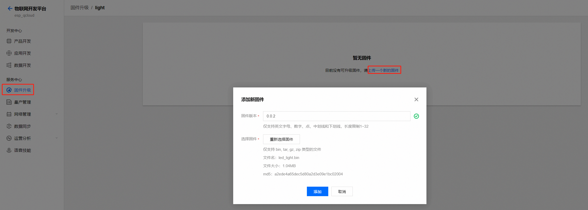
        </div>

    3. **下发固件**

        下发固件有 2 种形式，通过平台下发、通过小程序下发。

        - **平台下发**

            <div  align="center">  
            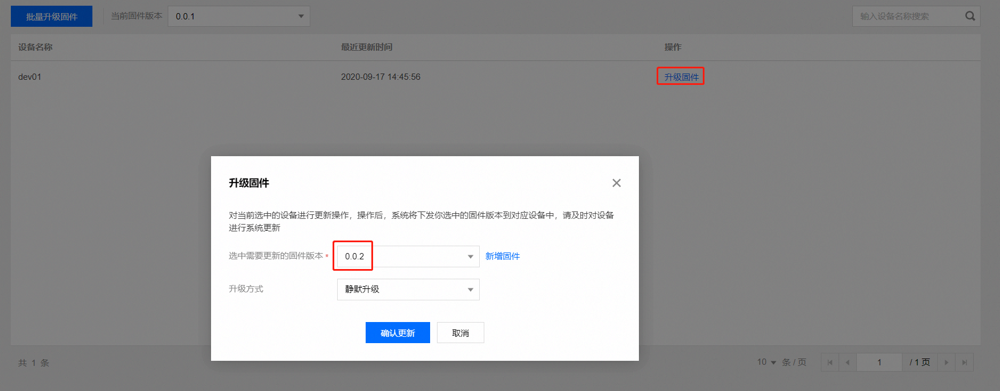
            </div>

            等待几分钟后，即可查询到状态。
            <div  align="center">  
            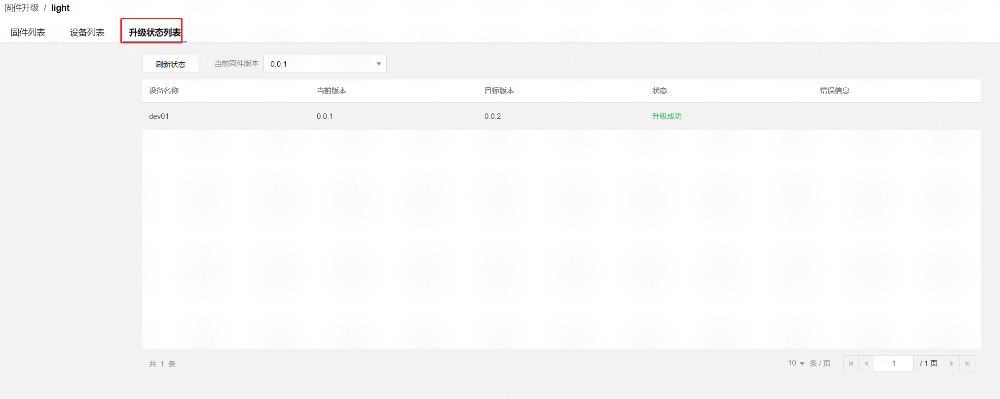
            </div>

        - **小程序下发**

            <div  align="center">  
            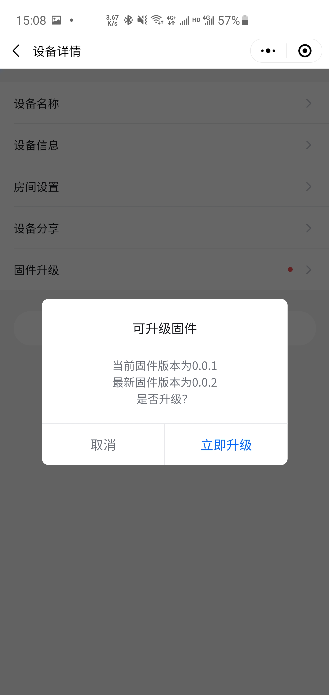
            </div>

            等待几分钟后，即可查询到状态。
            <div  align="center">  
            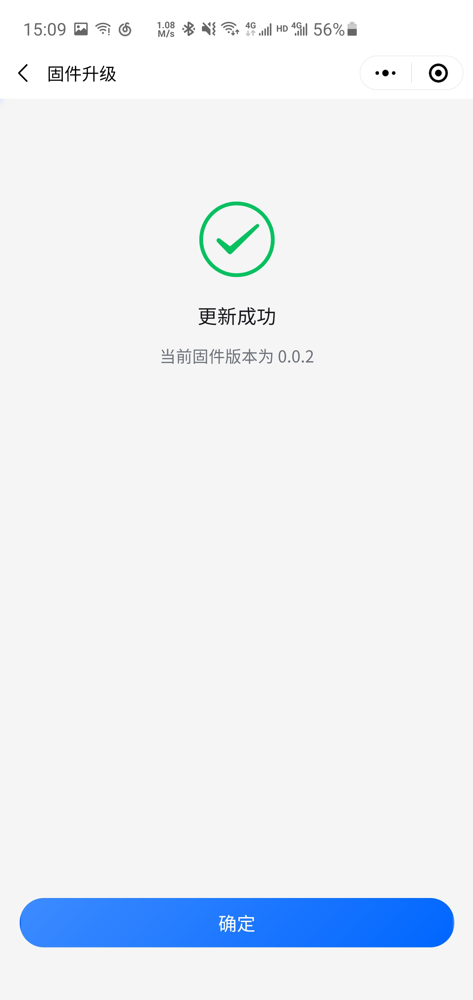
            </div>

    4. **版本回滚与校验【可选】**

        在实际开发中，针对不慎上传错误固件、固件存在致命而引发无限重启的情况，该套件提供版本回滚与校验操作，配置方法如下：

        1. **进入 `menuconfig` 配置界面**

            ```shell
            idf.py menuconfig
            ```

        2. **选择 `ESP QCloud Example Configuration -> ESP QCloud OTA Config`**

            ```shell
            [*] Skip firmware version check
            [*] Skip project name check
            ``` 
            - `Skip firmware version check`，当选择开启时，将跳过检查当前固件芯片。
            - `Skip project name check`，当选择开启时，将跳过检查当前固件命名。

        3. **选择 `ESP QCloud Example Configuration -> QCloud utils`**

            ```shell
            [*] Memory debug
            (128) QCLOUD Memory debug record max.
            (qcloud_app) Namespace where data is stored in NVS
            (3000) Continuous reboot interval(ms)
            (30) Continuous restart triggers version rollback
            ``` 

            - `Continuous restart triggers version rollback`，该选项可配置触发回滚所需的连续重启次数。

## 3. 设备调试

该例程已支持日志的上传、串口调试功能。

- **串口调试**

    串口调试允许通过串口查看当前设备信息，如需要开启，方法如下：

    1. **进入 `menuconfig` 配置界面**

        ```shell
        idf.py menuconfig
        ```

    2. **选择 `ESP QCloud Example Configuration`**

        ```shell
        Light development board selection   --->
        Light provisioning network selection  --->
        (5) More than this number of continuous uninterrupted restarts triggers a reset of the device
        [*] The device will be in debug mode
        ``` 

        - `The device will be in debug mode`，该选项可配置设备调试是否开启。
        
    3. **查看调试信息**

        - 该例程默认 10s 打印一次运行状态。

        ```shell
        I (31091) esp_qcloud_utils: System information sta_mac: 24:6f:28:80:3f:14, channel: [10/2], rssi: -40, free_heap: 181128, minimum_heap: 161540
        ```

        - 你可通过输入指令查看系统状态，例如执行 `heap` 指令，更多指令可通过 `help` 查询。

        ```shell
        esp32> heap
        I (15360) esp_qcloud_mem: (714) <esp_qcloud_log: 159> ptr: 0x3ffbd1c4, size: 16
        I (15361) esp_qcloud_mem: (716) <esp_qcloud_log_flash: 157> ptr: 0x3ffbdecc, size: 24
        I (15372) esp_qcloud_mem: (1093) <esp_qcloud_device: 85> ptr: 0x3ffbe8e4, size: 20
        I (15383) esp_qcloud_mem: (1093) <esp_qcloud_device: 218> ptr: 0x3ffc0d3c, size: 20
        I (15384) esp_qcloud_mem: (1093) <esp_qcloud_device: 218> ptr: 0x3ffc0d68, size: 20
        I (15395) esp_qcloud_mem: (1094) <esp_qcloud_device: 218> ptr: 0x3ffc0d80, size: 20
        I (15406) esp_qcloud_mem: (1094) <esp_qcloud_device: 218> ptr: 0x3ffc0da8, size: 20
        I (15417) esp_qcloud_mem: (3608) <esp_qcloud_iothub: 213> ptr: 0x3ffca3d4, size: 128
        I (15418) esp_qcloud_mem: Memory record, num: 8, size: 268
        I (15429) esp_qcloud_mem: Free heap, current: 181096, minimum: 161540
        I (15441) esp_qcloud_mem: ---------------- The State Of Tasks ----------------
        I (15441) esp_qcloud_mem: - HWM   : usage high water mark (Byte)
        I (15452) esp_qcloud_mem: - Status: blocked ('B'), ready ('R'), deleted ('D') or suspended ('S')

        I (15463) esp_qcloud_mem: TaskName              Status  Prio    HWM     TaskNum CoreID  RunTimeCounter  Percentage
        I (15464) esp_qcloud_mem: console_handle        R       1       1952    8       -1      26908           <1
        I (15475) esp_qcloud_mem: IDLE0                 R       0       1008    4       0       13232798        89
        I (15486) esp_qcloud_mem: mqtt_task             B       5       3472    12      -1      978102          6
        I (15487) esp_qcloud_mem: Tmr Svc               B       1       792     5       0       1851            <1
        I (15498) esp_qcloud_mem: qcloud_log_send       B       4       2580    7       0       3451            <1
        I (15509) esp_qcloud_mem: tiT                   B       18      2112    9       -1      26425           <1
        I (15510) esp_qcloud_mem: esp_timer             B       22      3348    1       0       38541           <1
        I (15521) esp_qcloud_mem: wifi                  B       23      3944    11      0       234073          1
        I (15532) esp_qcloud_mem: sys_evt               B       20      596     10      0       2884            <1
        ```

- **云端日志查看**    

    该例程已实现日志上传、云端存储功能，如有需要，开启方法如下：

    1. **开启日志**

    <div  align="center">  
    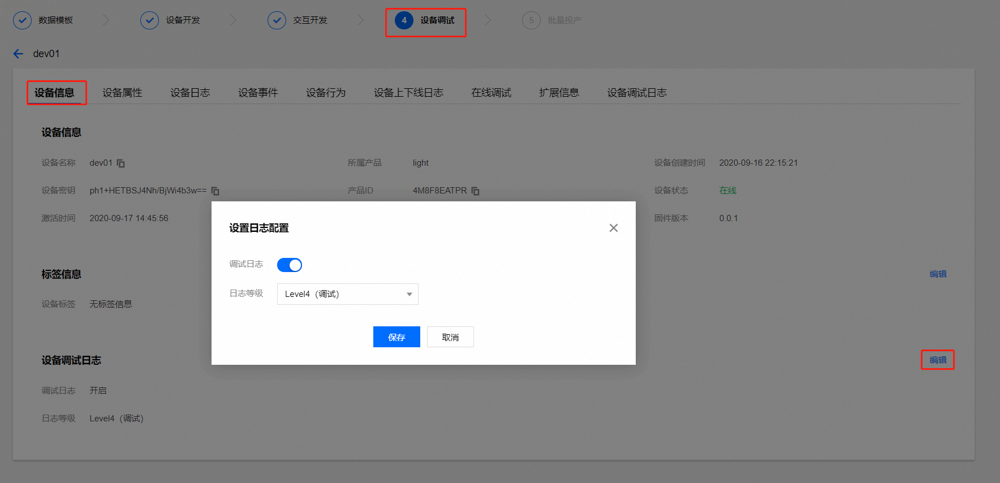
    </div>
    
    2. **查看日志**

    <div  align="center">  
    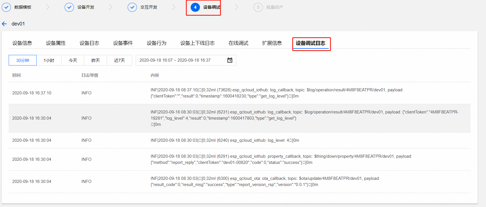
    </div>
